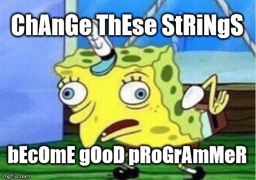

# Exercises: Strings

Implement the functions below in a file called `strings.c`

## Vertical

Write a function `vertical` that takes a string and prints each character of the string on a new line. For instance, `vertical("horizontal")` should print:

    h
    o
    r
    i
    z
    o
    n
    t
    a
    l

## Skip

Write a function `skip` that takes a string and prints each even character of the string. For instance, `skip("Great, gifts!")` should print:

    Get it!

## Eek

Write a function `eek` that takes a string and tells you how many e's that string contains. For instance, `eek("Eek a mouse!")` should print:

    The text "Eek a mouse!" contains 3 e's.

## tHe CaSe Of BoB

SpOnGeBoB tAlKs FuNnY, lIkE tHiS:

Create a function `bob` that takes a string and prints that string into the alternating case of Spongebob. For instance, `bob("Know your meme")` should print:

    Spongebob says: kNoW yOuR mEmE
